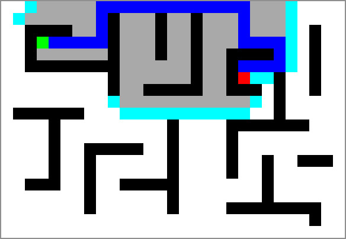

# simulación del algoritmo A\*

Este proyecto es una simulación del algoritmo A\* (Astar), un algoritmo de búsqueda utilizado para encontrar el camino más corto en un grafo. Esta implementación permite visualizar cómo funciona el algoritmo en un entorno gráfico.

## Tabla de Contenidos

- [Características](#características)
- [Instalación](#instalación)
- [Uso](#uso)
- [Ejemplo](#ejemplo)

## Características

- Visualización del proceso de búsqueda del algoritmo A\*.
- Soporte para diferentes heurísticas (por ejemplo, distancia Manhattan).
- Interfaz gráfica simple para interactuar con el entorno de simulación.

## Instalación

Para instalar y ejecutar este proyecto, sigue estos pasos:

1. Clona el repositorio:
   ```bash
   git clone https://github.com/tu_usuario/simulacion_astar.git
   cd simulacion_astar
   ```
2. Crea un entorno virtual (opcional)

   ```bash
   python -m venv venv
   source venv/bin/activate  # En Windows usa: venv\Scripts\activate
   ```

3. Instala dependencias
   Siendo un proyecto en python es necesario tener instalado python.
   Además instala pygame con pip:

   ```bash
   pip install --upgrade pip
   pip install pygame
   ```

## Uso

Ejecuta el siguiente comando:

```bash
python main.py
```

Pasos:

- clic: una vez para definir la partida, una segunda vez para definir la meta
- spacebar: aplicar el algoritmo y ver simulación

## Ejemplo


